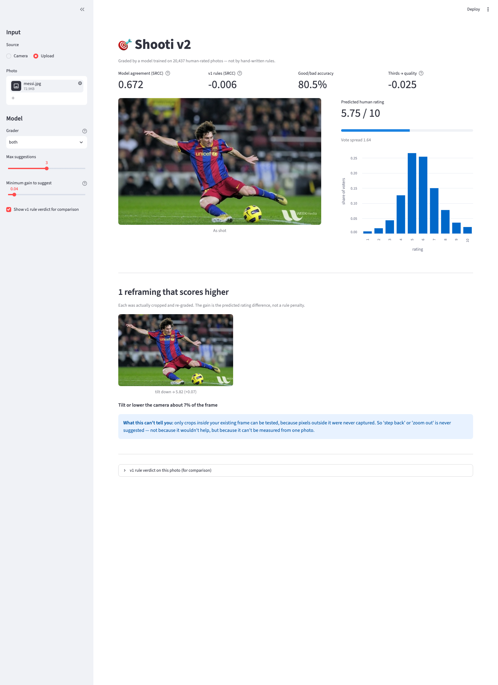
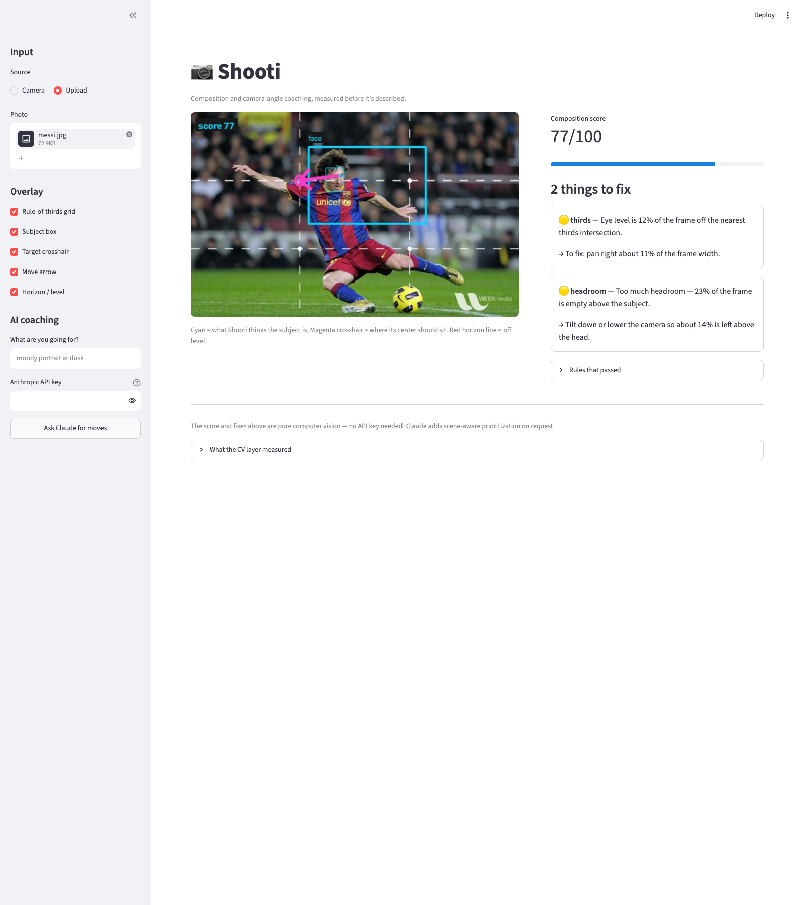

# 📷 Shooti

An AI photography assistant that tells you how to *move* — not just what's wrong.

> **v2 is here, and it disproved v1.** `app2.py` grades photos with a model
> trained on 20,437 human-rated images instead of hand-written rules. Measured
> on 5,110 held-out photos, v1's rule score correlated with human judgment at
> **SRCC −0.006** — no better than noise — while the learned grader reaches
> **0.682**. See [Results](#v2-results-what-the-data-said) below. v1 is kept
> runnable for comparison, not because it works.

Point it at a photo (or shoot one in the browser) and it measures the framing,
then hands back concrete camera moves: pan left 11% of the frame, roll 6°
counter-clockwise, lower the camera, give the subject looking room.

Built for Project 0. It demonstrates the two required properties:

- **Intelligence** — an eight-rule composition engine over real computer vision:
  DNN face detection with facial landmarks, gradient-energy saliency for
  non-face subjects, Hough-transform horizon detection for roll *and* camera
  pitch, and a weighted 0-100 score. Every number is measured, not guessed.
- **Interaction** — a camera/upload GUI that draws the analysis back onto your
  photo (thirds grid, subject box, eye line, and an arrow from where the subject
  *is* to where it *should be*), plus optional Claude vision coaching that
  prioritizes the three moves worth making.

**📊 [How it works — flow charts of both pipelines](docs/architecture.md)** —
the shared measurement layer, the two judges, the counterfactual advice loop, and
the training split discipline.

## The design bet

Most photo-feedback tools describe a photo. Shooti's split is deliberate:

**Geometry is measured, never asked of the LLM.** The CV layer computes position,
roll, pitch, headroom, subject size, and balance, and produces a score with no
API key required. Those measurements are then handed to Claude *as text
alongside the image*, with instructions not to re-estimate them. Claude does only
what geometry can't: recognize what the subject actually is, read the light and
background, and rank the fixes.

This means the app is fully useful offline, the advice is reproducible, and the
LLM can't hallucinate a pixel coordinate.

## Setup

Requires Python 3.10+ (3.13 recommended — the `anthropic` SDK dropped 3.9).

```bash
python3.13 -m venv .venv
.venv/bin/pip install -r requirements.txt
.venv/bin/python -m streamlit run app.py
```

The face detector downloads a 227 KB ONNX model into `models/` on first run. If
that download fails, face detection degrades to the saliency path instead of
crashing.

Claude coaching is optional. To enable it, either export a key:

```bash
export ANTHROPIC_API_KEY=sk-ant-...
```

or paste one into the sidebar, or run `ant auth login` (the SDK picks up the
profile automatically). Without any of these, the score and rule findings still
work — only the "Ask Claude for moves" button needs credentials.

## Verify it without the UI

```bash
.venv/bin/python scripts/smoke_test.py
```

Runs the full CV pipeline over synthetic scenes plus anything you drop in
`samples/`, prints every measurement, and writes annotated overlays to `out/`.
No API key needed.

## What the rules check

| Rule | Measured from | Output |
|---|---|---|
| thirds | eye level (people) or subject centroid | pan/raise/lower, in % of frame |
| tilt | dominant near-horizontal Hough line | roll angle + direction to correct |
| camera pitch | horizon offset from center row | high/low angle detection |
| headroom | estimated head top vs. frame top | tilt or height change |
| looking room | nose offset from eye midpoint (head yaw) | pan to open space ahead of the gaze |
| edges | subject box vs. frame border | crop warnings |
| subject size | subject area / frame area | move closer or step back |
| balance | left/right gradient-energy split | pan or reposition subject |

**Direction convention** (fixed once, in `shooti/rules.py`): panning the camera
left moves the frame left, so the subject appears further right. Every move
string follows from that, including the vertical case — raising the camera pushes
the subject *down* in frame. This inversion is easy to get backwards and is
worth a unit test (see [issue tracker](../../issues)).

## Layout

```
app.py                 Streamlit UI
shooti/subject.py      YuNet face detection + landmarks, saliency fallback
shooti/rules.py        the eight rules, the score, the direction conventions
shooti/overlay.py      draws grid, subject box, eye line, target, move arrow
shooti/coach.py        Claude vision call (claude-opus-5) + measurement grounding
shooti/loader.py       EXIF-aware image decoding
scripts/smoke_test.py  runs the pipeline, no API key
scripts/gh_bootstrap.sh  creates the GitHub labels, milestones, and issues
```

## Known limits

Honest list, since the assignment asks for strengths *and* weaknesses:

- **Subject extent is approximate.** With a face detected, Shooti unions the
  face-implied head-and-shoulders box with an overlapping saliency blob to
  estimate the body. On a full-body action shot it still under-covers the
  subject, so "subject size" advice can read low. A segmentation model would fix
  this properly.
- **Saliency is not semantics.** With no face in frame, "the subject" is the
  highest-energy compact gradient blob. On a busy background it can pick the
  wrong thing. It reports `none` rather than guessing when the frame is flat.
- **Pitch detection needs a horizon.** The camera-angle estimate comes from where
  the horizon crosses frame center, so it silently abstains indoors.
- **Thresholds are hand-tuned, not fitted.** They were set from photographic
  convention and spot-checked, not calibrated against a labeled set. That
  calibration is tracked as open work.
- **Not yet real-time.** It analyzes a captured frame, not a live preview. The
  live-guidance loop is the main remaining feature.

---

# v2 — learned grading

v1's premise was that composition rules define quality: off-thirds is worse,
tilted is worse, and a weighted sum of violations is a score. v2 tests that
premise against human ratings, and it does not survive.

## v2 results: what the data said

Trained on the AVA subset (`trojblue/AVA-aesthetics-10pct-min50-10bins`, every
photo with 50+ human votes). Fit on 17,371 images, best epoch chosen on 3,066
carved out of train, and the numbers below measured on **5,110 photos used for
neither fitting nor selection**.

| Model | SRCC ↑ | PLCC ↑ | MSE ↓ | good/bad acc ↑ |
|---|---|---|---|---|
| **v1 hand-tuned rules** | **−0.006** | 0.008 | 5.014 | 65.9% |
| Learned: geometry only | 0.166 | 0.166 | 0.538 | 71.4% |
| Learned: CLIP only | **0.682** | 0.689 | 0.290 | 80.1% |
| Learned: CLIP + geometry | 0.672 | 0.680 | 0.298 | **80.6%** |

Three findings, including one that is bad news for the approach:

1. **v1's rule score carries no signal.** SRCC −0.006 across 5,110 photos. Not
   "too strict about thirds" — as a predictor of human judgment it was noise.
2. **Thirds distance does not predict quality.** SRCC −0.025, **p = 0.077**, so
   not significant even at the 5% level. Distance from dead center is likewise
   flat (−0.017, p = 0.23). The single assumption v1 was built on is unsupported.
3. **The geometric features add nothing on top of CLIP** (0.672 vs 0.682). The
   18 hand-engineered measurements are redundant once the model can see the
   image. That is a negative result about my own feature engineering, and it is
   reported rather than buried.

Calibration for the headline number: published NIMA-style models reach roughly
SRCC 0.6–0.7 on full AVA, so 0.682 is in the expected range. It is *not* directly
comparable to those papers — this subset keeps only photos with 50+ votes, which
makes the labels cleaner than the full set.

## How v2 gives advice without rules

The grader alone would be a black box that says "6.2/10" and nothing actionable.
So advice comes from **counterfactual search** instead of rule violations:

1. Build 14 candidate reframings — pans, tighter crops, rolls.
2. Actually crop each one and re-grade it with the model.
3. Report only the ones that score higher than the frame as shot.

This is what fixes the complaint that started v2. A centered or symmetric photo
that cannot be improved by shifting simply produces **no shift suggestion** — no
rule needs special-casing. In a 12-photo spot check, the model declined to
suggest anything for 3 of them; v1 flagged nearly all of them.

Two things were verified rather than assumed:

- **The model responds to reframing.** Mean spread of predicted scores across
  candidates was 0.51 (`both`) and 0.44 (`clip`), never flat. Had it been ~0, the
  suggestions would have been meaningless.
- **No synthetic pixels are ever graded.** Rotated candidates crop to 74% scale,
  verified to stay inside the frame, so the model never scores reflected or black
  borders.

`both` is the default for advice despite grading marginally worse, because it is
measurably more responsive to framing changes (0.51 vs 0.44) — geometry gives the
model an explicit handle on the thing the advice is about.

## Both versions on the same photo



v2 predicts a 5.75/10 human rating, shows the full predicted vote distribution
(so you can see how divisive a shot is, not just its average), and finds exactly
one reframing worth making — a 7% downward tilt, worth +0.07.



v1 on the identical photo asserts "2 things to fix": the eye level is 12% off a
thirds intersection, and there is 23% headroom. Neither claim is connected to
whether anyone likes the photograph.

## Running v2

```bash
.venv/bin/pip install -r requirements-v2.txt
.venv/bin/python -m streamlit run app2.py
```

Both screenshots above were produced by `scripts/drive_app.py`, which launches
the app in a real headless browser, uploads a photo through the actual file
input, and screenshots the result — so "it works" means the UI rendered, not
that a port opened:

```bash
.venv/bin/pip install -r requirements-dev.txt
.venv/bin/playwright install chromium
.venv/bin/python scripts/drive_app.py --app app2.py --photo samples/messi.jpg
```

The trained checkpoints are committed (1.3 MB), so this works immediately. To
reproduce training from scratch (~15 min, ~3.4 GB of transient download):

```bash
python -m shooti.grader.prepare --split train       # ~5 min at 70 img/s
python -m shooti.grader.prepare --split validation  # ~1 min
python -m shooti.grader.train --ablate              # seconds
```

Add `--cleanup` to `prepare` to delete each parquet shard after use, which keeps
peak disk around 0.5 GB instead of 3.4 GB.

## v2 limits

- **Only crops inside the existing frame can be tested.** "Step back" or "zoom
  out" is never suggested — not because it wouldn't help, but because the pixels
  outside your frame were never captured, so the model cannot score it.
- **AVA is DPChallenge, not your photos.** It skews toward contest-style images
  from the 2000s. A grader trained on it inherits that taste, and there is no
  reason to expect it to match any individual photographer's.
- **SRCC 0.68 is useful, not authoritative.** It ranks photos far better than
  chance and far better than v1, but it will disagree with you on individual
  shots. It is a second opinion, not a verdict.
- **Held-out ≠ a third split.** This dataset's `test` split is a byte-identical
  copy of its `validation` split (verified: all 5,110 ids match), so the
  selection set is carved out of train instead. Anyone extending this should not
  treat `test` as extra data.
- **`both` vs `clip` is a real tradeoff,** not a free win: better advice
  responsiveness, slightly worse grading.

## Layout (v2 additions)

```
app2.py                      Streamlit UI for the learned grader
shooti/grader/features.py    the same measurements as v1, as features not penalties
shooti/grader/embed.py       frozen CLIP ViT-B/32 image embeddings
shooti/grader/model.py       NIMA-style distribution head + EMD loss
shooti/grader/prepare.py     builds the feature cache from AVA parquet shards
shooti/grader/train.py       training, ablation, and the honest split discipline
shooti/grader/eval.py        re-score a checkpoint on any cached split
shooti/grader/grade.py       inference
shooti/grader/advise.py      counterfactual reframing search
checkpoints/report_test.json every number in the table above
```

## Project management

Work is tracked in GitHub Issues and milestones. `scripts/gh_bootstrap.sh`
recreates the whole board from scratch, so the plan is version-controlled
alongside the code.

---

# v3 — intent-conditioned rule sets

You state what you're going for; Claude picks the rule set that fits. Nine rule
sets, each switching different rules on and off:

| Rule set | Switches off | Inverts |
|---|---|---|
| Portrait | — | — |
| Group photo | thirds | centering is rewarded |
| Symmetry / architecture | thirds, headroom, size, looking room | centering rewarded, balance strict |
| Landscape | headroom, size, looking room | — |
| Street / documentary | camera pitch | 6° tilt tolerance, clipped edges fine |
| Action / sports | camera pitch | looking room weighted 2× |
| Minimalist | headroom, looking room | a *small* subject is the goal |
| Product / flat lay | thirds, headroom, looking room | centering rewarded |
| No stated intent | — | v1's universal set, kept as the baseline |

The point is the difference between **"not applicable"** and **"barely
penalized"**. A symmetry rule set does not score thirds leniently — it declares
thirds inapplicable and says so. On the test photo, v1 flags 2 problems and
scores 84; the action rule set flags 1 and scores 97, because 23% headroom is
normal in a sports frame.

## Does conditioning actually make the rules predictive? No.

The hypothesis was worth testing: maybe rules fail only because the *wrong* ones
are applied. Measured on the 5,110 held-out AVA photos, with CLIP zero-shot
standing in for stated intent:

| Scorer | SRCC vs human ratings | p |
|---|---|---|
| Universal rules (v1) | −0.006 | 0.67 |
| **Intent-conditioned rules (v3)** | **+0.007** | **0.62** |
| Learned grader (v2) | **+0.682** | — |

Conditioning moved correlation by +0.013 — still indistinguishable from zero.
`action` reached p=0.036 on its own subset, but eight profiles were tested and
one hit near p=0.05 is exactly what multiple comparisons produce by chance.

**And this result is confounded, which matters more than the number.** Inspecting
the assignments by eye (`out/assignment_check.png`) showed CLIP zero-shot is
unreliable at guessing intent: "portrait" collected a pickup truck and a cat,
"action" collected a stationary butterfly and a goose. Only "landscape" looked
consistently right. So the experiment cannot separate *"conditioning doesn't
help"* from *"the intent was inferred wrongly"*.

What it does establish: **automatic intent inference plus these hand-tuned rule
sets does not rescue rule-based scoring.** It is not a clean test of whether
*user-stated* intent would, because AVA has no stated intent to test with.

## So what is v3 actually for?

Given the above, v3 does not use rule scores as a quality verdict. The split:

- **Quality number** comes from the v2 learned grader (SRCC 0.682).
- **Advice** comes from the intent-conditioned rules, which are interpretable and
  now appropriate to the goal — a centered symmetry shot is praised for
  centering rather than scolded for it.

That is a smaller claim than "v3 grades better", and it is the one the evidence
supports.

## Running v3

```bash
.venv/bin/python -m streamlit run app3.py
```

Works with **no API key**: rule-set selection falls back to keyword matching and
says so on screen. With a key (sidebar or `ANTHROPIC_API_KEY`), Claude reads the
photo plus your free-form intent and picks — which handles descriptions keywords
cannot, like "I want this to feel lonely".

To reproduce the experiment:

```bash
python -m shooti.intent.experiment --split validation
```

## v3 limits

- **The Claude selection path is unverified by me.** No API key was available at
  any point in this project, so `select_claude` has never made a real call. Its
  request shape is checked against the installed SDK and its failure paths are
  tested, but the happy path is untested.
- **Profile parameters are hand-set guesses**, not fitted. The tolerances come
  from photographic convention, and the experiment above gives no evidence they
  are right.
- **Nine rule sets is a coarse taxonomy.** Real intent is continuous, and a photo
  can be two things at once. Only one set is applied.
- **Keyword fallback is not language understanding.** It matches a word list. "I
  don't want a portrait" selects Portrait.

---

# v4 — human portraits only

v1 through v3 tried to judge every photograph. That breadth was the problem: one
engine cannot know that a symmetric building wants centering while a turned head
wants nose room. v4 gives up every other subject and gets specific.

## Rules that only exist because the domain is narrow

| Rule | What it measures | Why it needs a portrait |
|---|---|---|
| **crop line** | where the frame cuts the body, in head-heights | "never crop at a joint" is *the* portrait rule and is meaningless elsewhere |
| **eye line** | eyes vs a crop-dependent target band | a close-up wants eyes ~40% down; a full-length wants ~20% |
| **headroom** | crown to frame top, band set by crop | an extreme close-up *should* crop the crown |
| **nose room** | open space in the direction the head is turned | needs actual head yaw, not a bounding box |
| **camera height** | face pitch relative to the lens | shooting up the nostrils is a portrait-specific failure |
| **head tilt** | roll from the eye line | 3–16° flatters; dead level reads formal; 22°+ reads accidental |
| **eye focus** | eye-region sharpness vs background | in a portrait the near eye carries the picture |
| **face exposure** | clipping and crushing on the face only | face highlights matter more than frame highlights |
| **light direction** | left/right luminance across the face | flat light renders features without shape |
| **background intrusion** | vertical lines running into the head | the pole-growing-out-of-their-head problem |

## How the body is located without body detection

Cropping rules need joints, and a single photo gives no body landmarks. v4 uses
the solution figure drawing uses: **the head is the unit.** An adult standing
figure is ~7.5 heads tall and every landmark sits at a known depth, so face
detection locates the head and the rest follows.

Joint zones (crop here and it reads as an amputation): neck 1.02–1.30, shoulder
1.32–1.52, elbow 2.72–3.00, wrist 3.68–3.98, knee 5.18–5.62, ankle 7.02–7.32
head-heights from the crown.

Verified against a real portrait: the predicted chin line landed on the subject's
chin and the shoulder line on her shoulder, and the frame genuinely ended at
1.50 heads — a shoulder cut, correctly flagged.

**The assumption is upright, adult, one subject.** The app draws the predicted
landmarks precisely so you can invalidate the analysis at a glance. In the test
set, a boy climbing a tree produced predicted lines that visibly do not match his
body, and `messi.jpg` reads 4.99 heads (mid-thigh) despite showing him head to
foot, because he is lunging almost horizontally.

## Head pose, and an ambiguity worth naming

Yaw, pitch and roll come from fitting a canonical 3D face to the five detected
landmarks with `solvePnP`. Five points suffice because the nose tip sits off the
plane of the eyes and mouth.

Focal length is unknown, so it is assumed to equal the image width — the estimate
is approximate, and frontal faces read a few degrees of false pitch. It refuses
outright below 12px between the eyes rather than reporting noise.

**A single face cannot distinguish "the camera is below the subject" from "the
subject raised their chin".** Both produce identical landmark geometry. So pitch
is reported as the face's angle *relative to the lens* — which is what actually
affects the photograph — and the advice offers both remedies.

## The human check, and why it only warns

Face detection answers a different question than "is this a person". On the test
set YuNet found the cartoon face painted on a Thomas the Tank Engine toy at 0.83
confidence with all five landmarks correctly placed. It was not wrong; that is a
face. It is not a human.

A CLIP zero-shot check gates on this, and its development is worth recording
because the first version was worse than useless:

| Prompt set | Result |
|---|---|
| Elaborate (5 non-human prompts incl. "doll or mannequin") | **3 of 6 real humans rejected** |
| Simplest possible ("a photo of a person" vs "a photo of a toy") | 7/7 on those samples |

The simple pair won, but it was *chosen* on those 7 samples, so that number is
selection-on-the-test-set. Evaluated properly on **24 face crops mined from a
different shard and hand-labelled, with no tuning against them: 22/24 (92%)** —
19/20 humans kept, 3/4 non-humans caught. Both errors sat within 0.003 of the
decision boundary, which is why there is now an explicit "uncertain" band.

**It never blocks.** A portrait tool that refuses a real portrait is worse than
one that analyses a cat, and at ~5% false-rejection it would do that.

## Running v4

```bash
.venv/bin/python -m streamlit run app4.py
```

No API key needed — v4 makes no LLM calls at all. Every rule is measured.

## v4 limits

- **Upright, adult, single subject.** Children run 5–6 heads rather than 7.5, so
  crop names shift for them. Seated and reclining subjects break the crop rule.
- **Head pose is approximate** — unknown focal length, a few degrees of bias on
  frontal faces, and refused below 12px inter-ocular.
- **The human check is 92% on n=24.** Small sample; treat as indicative.
- **Eye "sharpness" is a Laplacian ratio, not focus truth.** Heavy grain, high
  ISO noise, or a busy sharp background can move it either way.
- **Lighting is measured on the face box**, which includes hair and background at
  the corners, so side-ratio is a rough proxy for light direction.
- **No score validation.** Unlike v2's grader, the v4 score has *not* been tested
  against human ratings. Given that v1's and v3's rule scores both measured at
  ~0 correlation, the honest expectation is that this one has little predictive
  power either. Its value is the specificity of the individual findings, not the
  number.
