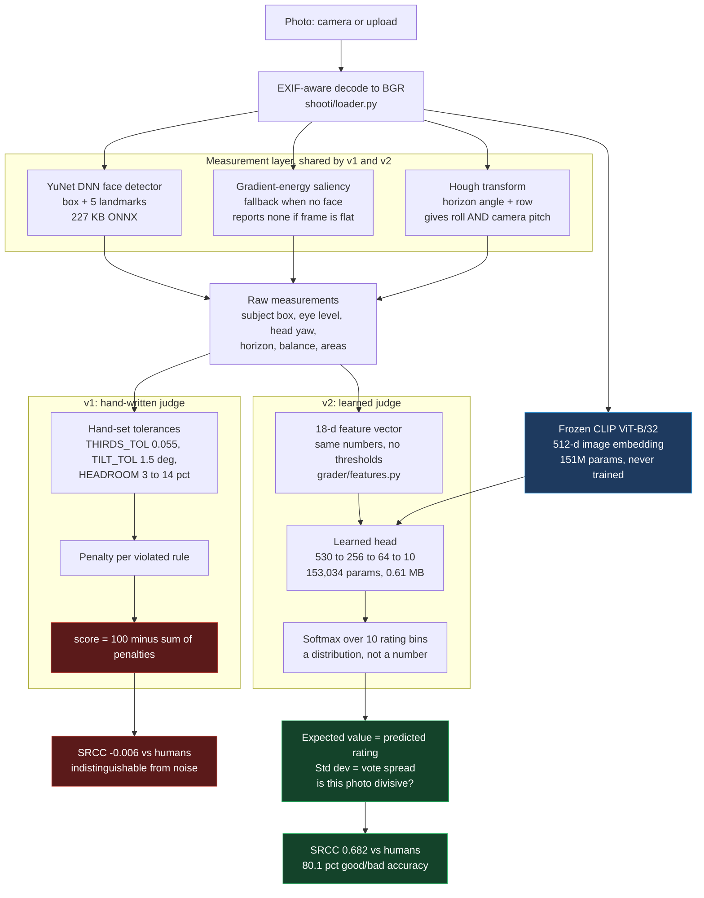
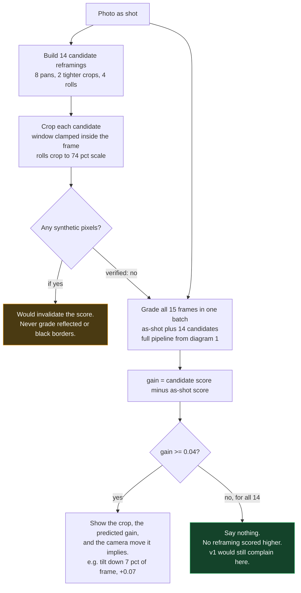
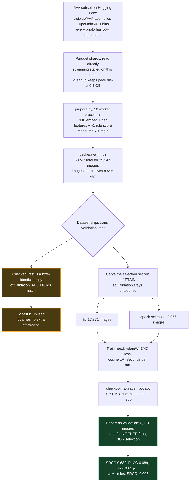

# How Shooti works

Three diagrams: what happens to one photo at runtime, how advice is produced
without rules, and how the grader was trained.

---

## 1. Two judges, one measurement layer

This is the whole story of the project. v1 and v2 measure the photo the *same
way* — the difference is entirely in who decides what the measurements mean. v1
applies thresholds a human wrote; v2 applies weights learned from 20,437
human-rated photos. Only one of them tracks human judgment.

**Why a distribution instead of a score.** On AVA, "6.0 because everyone said 6"
and "6.0 because half said 3 and half said 9" are very different photographs. The
second is divisive, and a coach should say so rather than average it away.
Training uses earth-mover distance rather than cross-entropy, because bin 3 is
closer to bin 4 than to bin 9 and the loss should know that.

---

## 2. Advice without rules: counterfactual search

v1 produced advice by asserting a rule was broken. v2 asks a different question —
*if I actually reframed the shot this way, would humans rate it higher?* — and
answers it by trying.

This is what fixes the original complaint. A centered or symmetric photo that
cannot be improved by shifting simply produces no shift suggestion. No rule needs
special-casing for it.

**Two things verified rather than assumed:**

- **The model responds to reframing.** Mean spread of predicted scores across the
  15 candidates was 0.51, never flat. Had it been near zero, the model would be
  blind to framing and every suggestion meaningless.
- **No synthetic pixels are ever graded.** Rolled candidates crop to 74% scale,
  checked to stay inside the frame.

**The limitation this design cannot escape:** only crops *inside* the existing
frame can be tested, because pixels outside it were never captured. So "step
back" or "zoom out" is never suggested — not because it wouldn't help, but
because it cannot be measured from one photo.

---

## 3. Training, and the split discipline

**Why the selection set is carved out of train.** Picking the best epoch on a set
and then reporting that same set's score is optimistic. The obvious fix — report
on the dataset's `test` split — does not work here, because that split is a
duplicate of `validation`. So the selection set comes out of `train`, and
`validation` is untouched until the final number. Train and validation are
genuinely disjoint (overlap: 0, verified).

This mattered. The first numbers reported were selection-set numbers presented as
held-out. Correcting it moved SRCC from 0.684 to 0.682 — a small change, but the
claim was wrong before.

---

## The ablation, and a negative result

| Channels into the head | SRCC | Accuracy |
|---|---|---|
| geometry only (18 features) | 0.166 | 71.4% |
| CLIP only (512-d) | **0.682** | 80.1% |
| CLIP + geometry (530-d) | 0.672 | **80.6%** |

The 18 hand-engineered geometric features **add nothing on top of CLIP** — the
combined model grades slightly worse than CLIP alone. That is a negative result
about the feature engineering in this project, and it is reported rather than
buried.

`both` is still the default for *advice*, for a measured reason: it is more
responsive to reframing (mean score spread 0.51 vs 0.44), because geometry gives
the model an explicit handle on the thing the advice is about. Better advice,
marginally worse grading — a real tradeoff, not a free win.

---

## Where each piece lives

| Stage | File |
|---|---|
| Decode | `shooti/loader.py` |
| Face + saliency detection | `shooti/subject.py` |
| Horizon / pitch | `shooti/rules.py` (`detect_horizon`) |
| v1 hand-written judge | `shooti/rules.py` |
| Measurements as features | `shooti/grader/features.py` |
| Frozen CLIP | `shooti/grader/embed.py` |
| Learned head + EMD loss | `shooti/grader/model.py` |
| Training cache | `shooti/grader/prepare.py` |
| Training + ablation | `shooti/grader/train.py` |
| Inference | `shooti/grader/grade.py` |
| Counterfactual advice | `shooti/grader/advise.py` |
| v1 UI / v2 UI | `app.py` / `app2.py` |
| Browser verification | `scripts/drive_app.py` |
